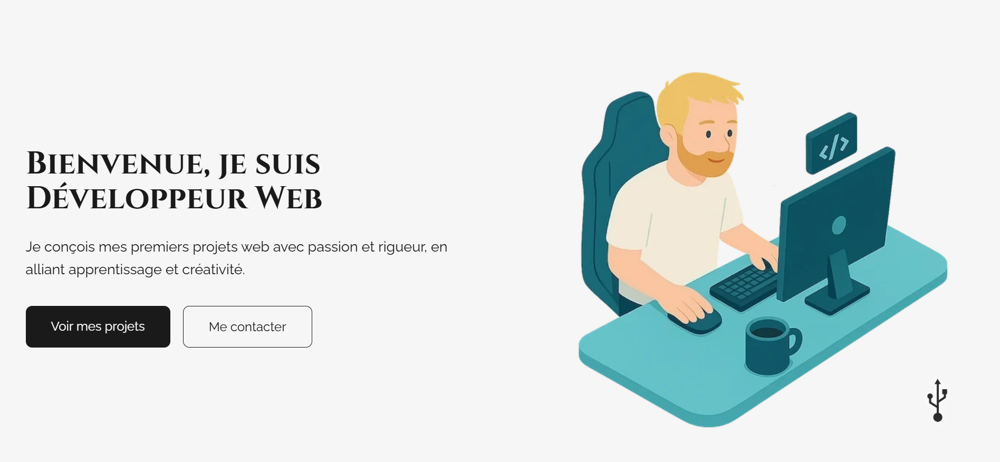
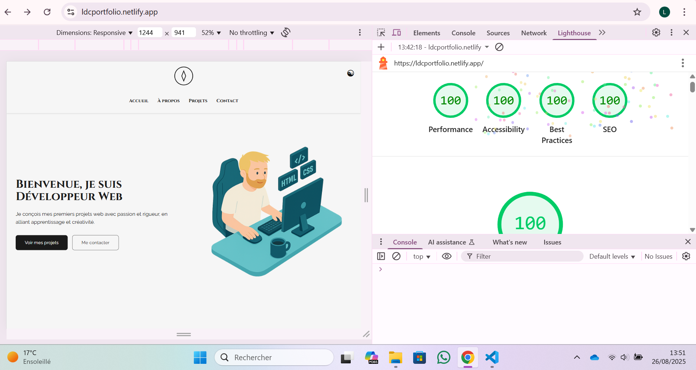

# Portfolio - Style *NieR:Automata*

Petit site portfolio personnel inspiré par l’univers de *NieR:Automata*.  
Design épuré, mode sombre/clair, responsive et optimisé en performance.

---

## 📸 Aperçu

  


---

## 📁 Structure du projet

```

nier_portfolio_v2/
├── index.html
├── style.css
├── script.js
├── carousel.js
└── assets/
└── images

```

---

## 🚀 Installation & Utilisation

Fonctionnalités
Dark / Light mode
→ Bouton ☯ en haut à droite pour basculer entre les deux thèmes.

Responsive design
→ Adapté aux mobiles, tablettes et écrans larges.

Performances optimisées
→ Chargement rapide, score Lighthouse élevé (voir capture).

Design NieR:Automata
→ Palette sombre, typographie inspirée, esthétique minimaliste.

##  Déploiement Netlify

[](https://app.netlify.com/sites/ldcportfolio/deploys)

📜 Licence
© 2025 - De Chiara Luca

Projet open-source, utilisation libre à des fins personnelles ou d’inspiration.