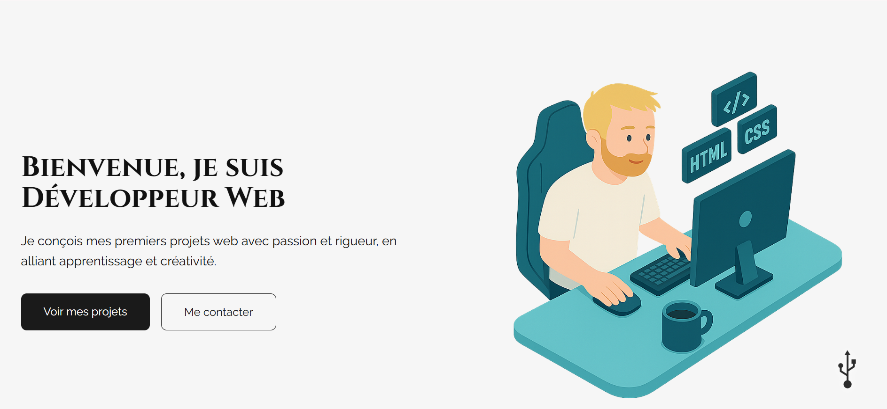

# Portfolio - Style *NieR:Automata*

Site portfolio personnel inspiré par l'univers de *NieR:Automata*.
Design épuré, mode sombre/clair, responsive et optimisé en performance.

---

## Aperçu



---

## Structure du projet

```
nier_portfolio_v2/
├── index.html
├── 404.html
├── style.css
├── script.js
├── carousel.js
├── i18n.js
├── package.json
├── documents/
│   └── dev-web-et-web-mobile.pdf
└── assets/
    └── images/
```

---

## Fonctionnalités

**Dark / Light mode**
→ Basculement entre les deux thèmes avec persistance via `localStorage`.

**Effets NieR (dark mode)**
→ Animation glitch, flash de corruption, son d'ambiance et effet scramble sur le logo NieR.
→ Bouton mute pour couper/rétablir le son, avec persistance via `localStorage`.
→ Effets désactivés automatiquement si `prefers-reduced-motion` est activé (accessibilité).

**Internationalisation (i18n)**
→ Support FR / EN / IT avec détection automatique de la langue du navigateur.

**Carousel de projets**
→ Présentation des projets avec aperçu, description et liens (démo + code source).

**Responsive design**
→ Adapté aux mobiles, tablettes et écrans larges.
→ Détection tactile pour désactiver les effets lourds sur mobile.

**Formulaire de contact**
→ Envoi de message intégré directement depuis le site.

**Page 404 personnalisée**
→ Page d'erreur dans le style NieR.

**Performances optimisées**
→ Images en `.webp`, chargement rapide, score Lighthouse élevé.

---

## Score Lighthouse


---

## Déploiement Netlify

[](https://app.netlify.com/sites/ldcportfolio/deploys)

---

## Licence

© 2025 - De Chiara Luca

Projet open-source, utilisation libre à des fins personnelles ou d'inspiration.
